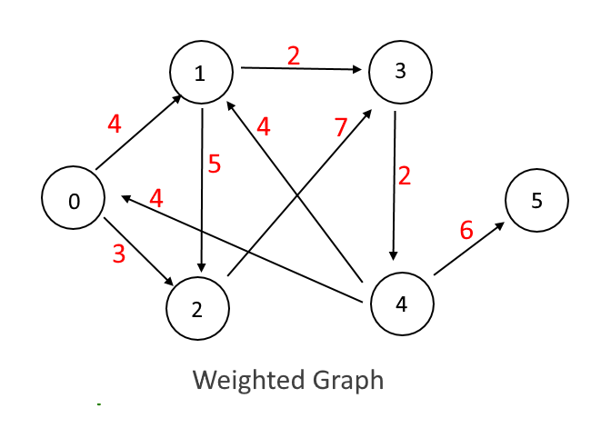

# Single Source Shortest Path with Apache Spark
## Assignment for *"Big Data Management"* class at UNSW
### Received mark: 25/25

Consider a graph consisting of vertices/nodes, edges and weights for the edges.  


A path in a graph can be defined as the set of consecutive nodes such that there is an edge from one node to the next node in the sequence. The shortest path between two nodes can be defined as the path that has the minimum total weight of the edges along the path. For example, the shortest path from Node 1 to Node 4 is Node1-> Node3 -> Node4 with the distance of 4. 

In this assignment, you are asked to calculate the distance from a starting node (e.g., N0) to all other nodes.

Please consider the following tips while implementing your solution: 
* In this assignment we assume there is no abandoned node, meaning that each node at least has one edge to another node.
* The minimum weight of an edge between two individual nodes is 1.
* You need to use Spark Core (not GraphX or similar solutions) to implement a solution for this given problem.
* The output must be sorted (ascending) by length of shortest path.
* The output should be written into a txt file.
* The output should be formatted as follow ( as shown in the example below) containing 3 columns, comma delimited : first column * contains the destination node, followed by the length of the shortest path in the second column, and the actual shortest path from the starting node to the destination node.
* You should NOT assume that the starting node is always N0 (it can be any given node).
* You can download a sample input , and expected output .
if the start-node is the last node of the graph (e.g.,N5), which means it has no way to get to another nodes, the output should be -1 for all the nodes as shown below :
```
N0,-1,
N1,-1,
...
```

**Input Format:**  
You can assume that the input represents a connected directed graph. The input is formatted as below (represents the same graph as the above image). Each line of the input file represents a vertex of the graph formatted like: starting node, end node, and the distance.
```
N0,N1,4
N0,N2,3
N1,N2,2
N1,N3,2
N2,N3,7
N3,N4,2
N4,N0,4
N4,N1,4
N4,N5,6
```

**Output Format:**  
The output should be formats as below. Each line of output represents the distance from the starting node to another node, and it is formatted as: the destination node, shortest distance, and the path from the starting node to the destination node. The file should be sorted by the shortest path:
```
N2,3,N0-N2
N1,4,N0-N1
N3,6,N0-N1-N3
...
```

For compilation and running use:
```
$ javac -cp ".:Spark-Core.jar" AssigTwo{zid}.java 
$ java -cp ".:Spark-Core.jar" AssigTwo{zid} STARTING_NODE INPUT_PATH OUTPUT_PATH
```
